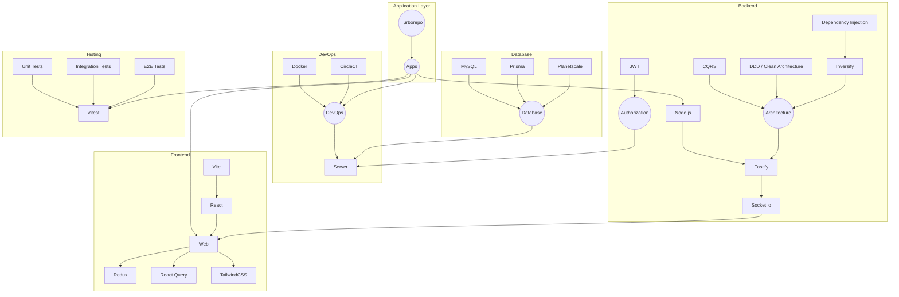

# 🗳️ Votemate

A real-time voting application 

| [Technologies used](#-technologies-used) |  [Flow](#-flow)  | [App Demonstration](#-app-demonstration)  | [Design](#-design) | [Packages](#-custom-local-packages) | [Scripts](#-scripts) | 
| ---------------------------------------- |  --------------- | ----------------------------------------- | ------------------ | ----------------------------------- | -------------------- | 

## 🔧 Technologies used

## 📊 Flow

## 📺 App demonstration

## 🎨 Design

The user interface and visual design of Votemate have been created using Figma. You can view the design by clicking the link below:

[Figma Design](https://www.figma.com/file/UhMvmdRwR6pnhJy9YkCC8E/Votemate?type=design&node-id=39%3A166&mode=design&t=E6auyLTlJxHyEJA8-1)

Feel free to explore the design to get an overview of the app's layout, color scheme, and other visual elements.

## 📦 Custom local packages

| @votemate/tsconfig     | @votemate/eslint-config|
| ---------------------- | -------------------- |
| shared tsconfig config | shared eslint config |

## 📜 Scripts

| Command Name     | Description                          | Type           |
|------------------|--------------------------------------|----------------|
| `start`          | Start the server in production mode  | Server, Global |
| `dev`            | Start the server in development mode | Server, Web, Global |
| `lint`           | Lint the code                        | Server, Web, Global |
| `lint:fix`       | Fix linting issues                   | Server, Web, Global |
| `ts:check`       | Check TypeScript code                | Server, Web, Global |
| `check`          | Run lint and ts:check                | Server, Web, Global |
| `test:unit`      | Run unit tests                       | Server         |
| `test:integration` | Run integration tests             | Server         |
| `test:e2e`       | Run end-to-end tests                 | Server         |
| `test:all`       | Run all tests                        | Server         |
| `build`          | Build the project                    | Server, Web, Global |
| `prisma`         | Generate Prisma client               | Server, Global |
| `prisma:push`    | Push Prisma schema changes           | Server, Global |
| `prisma:studio`  | Start Prisma Studio                  | Server, Global |
| `prisma:gp`      | Generate and push Prisma schema      | Server, Global |
| `prisma:gp:test` | Generate and push test Prisma schema | Server, Global |
| `db:up`          |Launch Docker container with MySQL server instance| Server, Global |
| `db:down`        | Stop and remove Docker container with MySQL server instance | Server, Global |
| `prebuild`       | Check TypeScript code before building| Web            |

